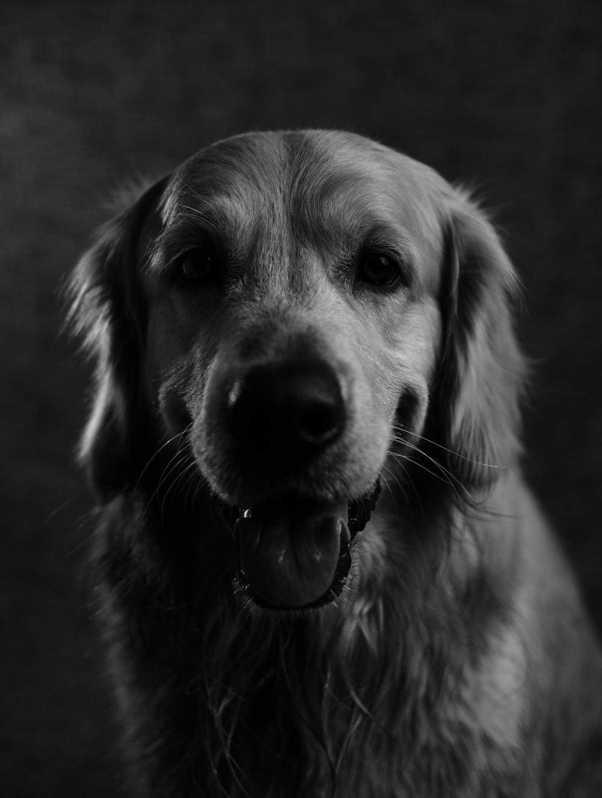
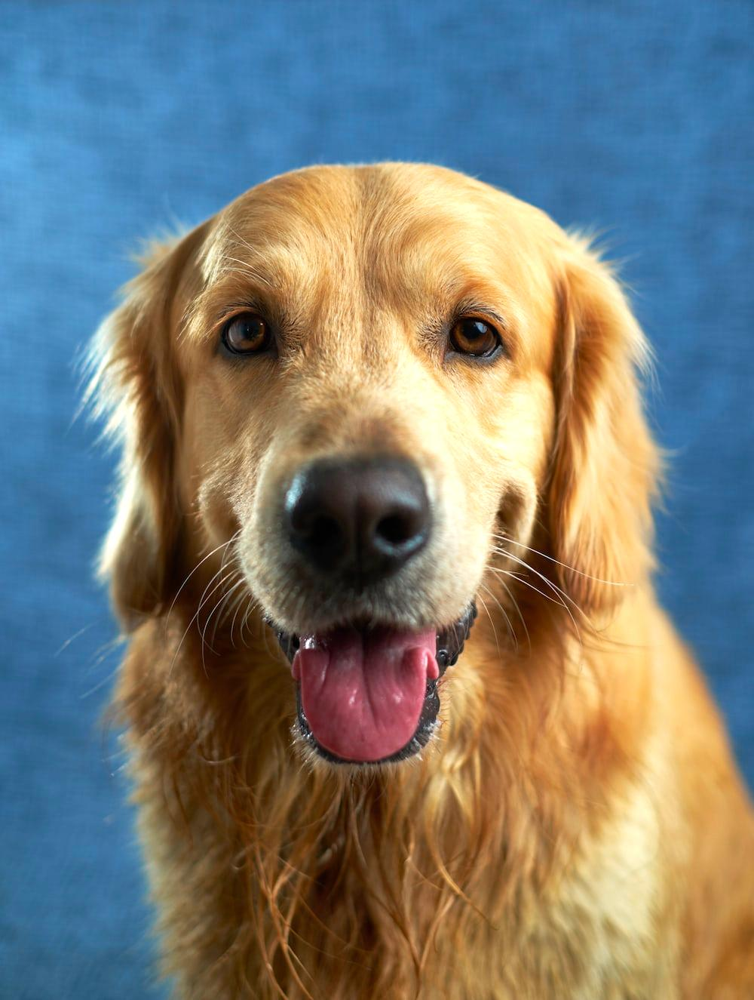
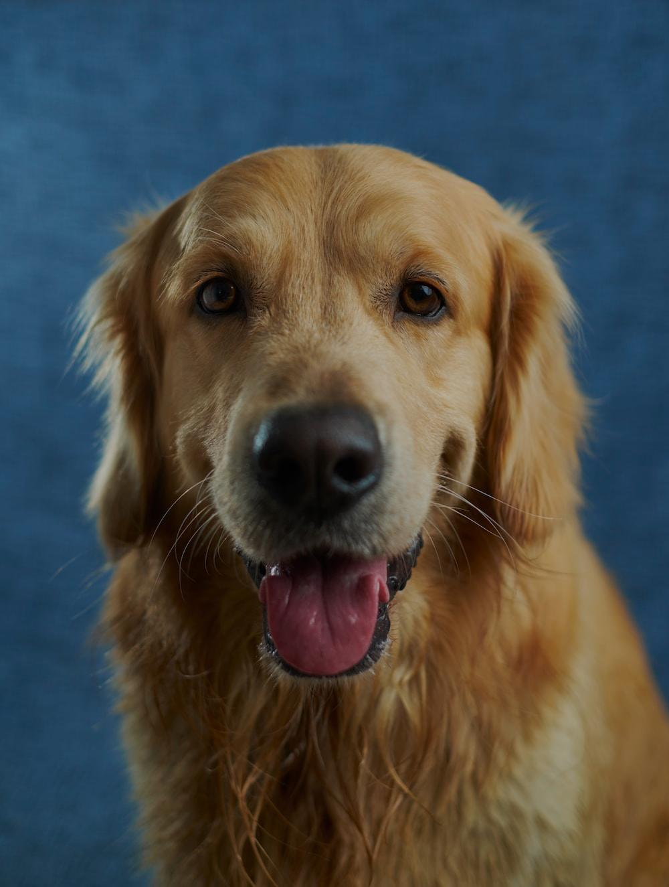
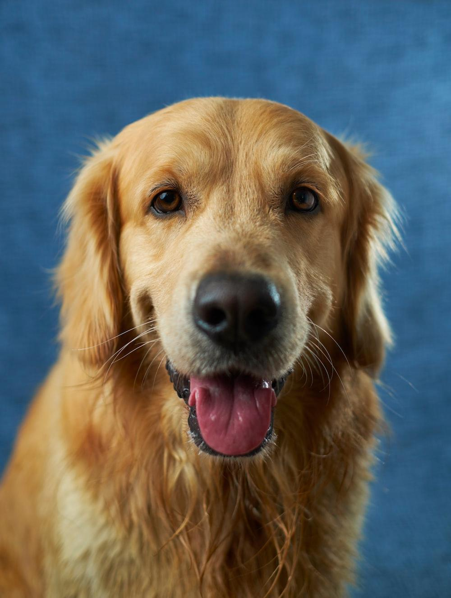
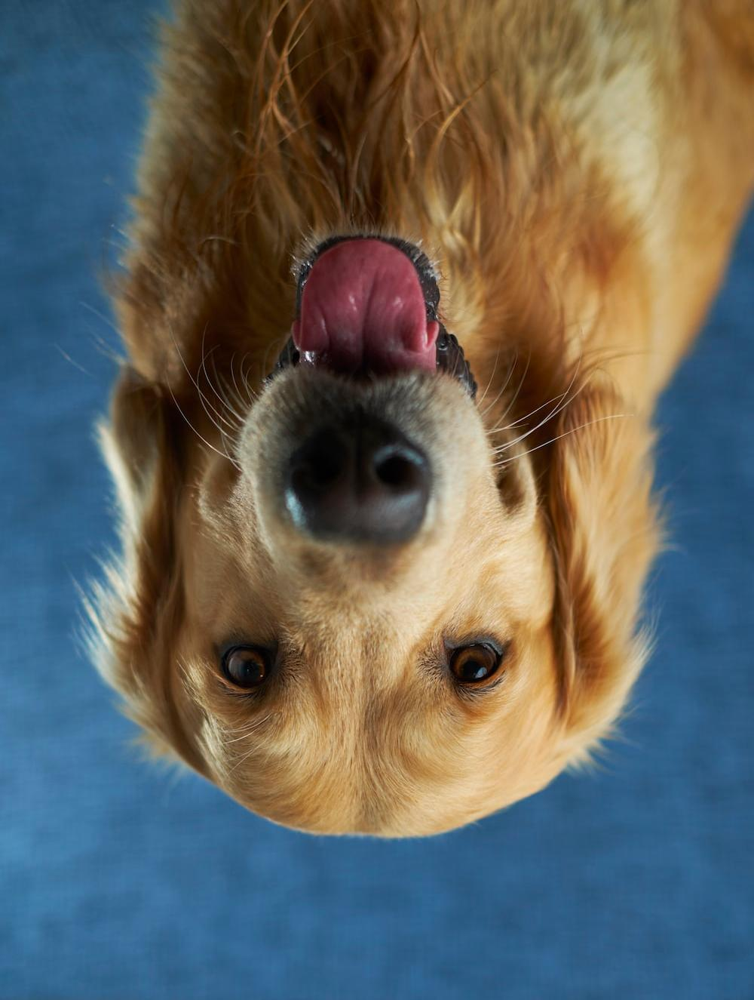

# ImageEditor
Java CLI Based Image Editor
## Overview
This Java program provides basic image processing operations. It allows users to perform various operations on images, including grayscale conversion, brightness adjustment, image rotation, and horizontal/vertical mirroring.
## Functions
Original

### Function 1 :convertToGrayscale
Description:
Converts the input image to grayscale.

Algorithm:
- Get the height and width of the input image.
- Create a new grayscale image with TYPE_BYTE_GRAY.
- Iterate through each pixel:
  - Copy the pixel value from the input image to the grayscale output image.

### Function 2: IncreaseBrightness
Description:
Increases the brightness of the input image.

Algorithm:
- Get the height and width of the input image.
- Create a new color image with TYPE_3BYTE_BGR.
- Iterate through each pixel:
  - Get the color of the pixel at (col, row).
  - Extract the red, blue, and green components.
  - Increase brightness by a specified percentage.
  - Ensure RGB values stay within the valid range [0, 255].
  - Create a new Color with the adjusted RGB values.
  - Set the pixel in the output image.

### Function 3: DecreaseBrightness
Description:
Decreases the brightness of the input image.

Algorithm:
- Get the height and width of the input image.
- Create a new color image with TYPE_3BYTE_BGR.
- Iterate through each pixel:
  - Get the color of the pixel at (col, row).
  - Extract the red, blue, and green components.
  - Decrease brightness by a specified percentage.
  - Ensure RGB values stay within the valid range [0, 255].
  - Create a new Color with the adjusted RGB values.
  - Set the pixel in the output image.

### Function 4: RotatetheImage
Description:
Rotates the input image by 90 degrees.

Algorithm:
- Get the height and width of the input image.
- Create a new image with switched height and width.
- Iterate through each pixel:
  - Copy the pixel value from the input image to the output image, swapping coordinates.

### Function 5: MirrortheImage
Description:
Mirrors the input image horizontally.

Algorithm:
- Get the height and width of the input image.
- Create a new image with the same dimensions as the input image.
- Iterate through each pixel:
  - Copy the pixel value from the input image to the output image with the column index mirrored.

### Function 6: MirrortheImageVertically
Description:
Mirrors the input image vertically.

Algorithm:
- Get the height and width of the input image.
- Create a new image with the same dimensions as the input image.
- Iterate through each pixel:
  - Copy the pixel value from the input image to the output image with the row index mirrored.

### Function 7: blurImage
Description:
Blurs the input image using a simple averaging filter.

Algorithm:
- Get the height and width of the input image.
- Create a new image for the blurred result.
- Define a kernel size (e.g., 3x3).
- Iterate through each pixel:
  - Calculate the average color value within the kernel.
  - Set the pixel in the output image with the calculated average color.
  
## Usage:

- Compile the Java code using: `javac Main.java`
- Run the program with: `java Main`
- Choose an operation by entering the corresponding number.
- Follow on-screen instructions for specific operations.
- The edited image will be saved as a new file with a relevant name.

